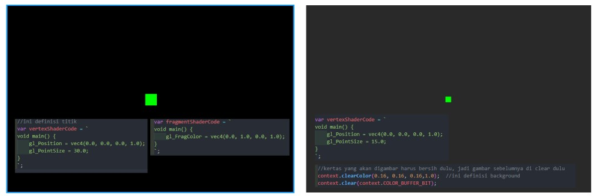
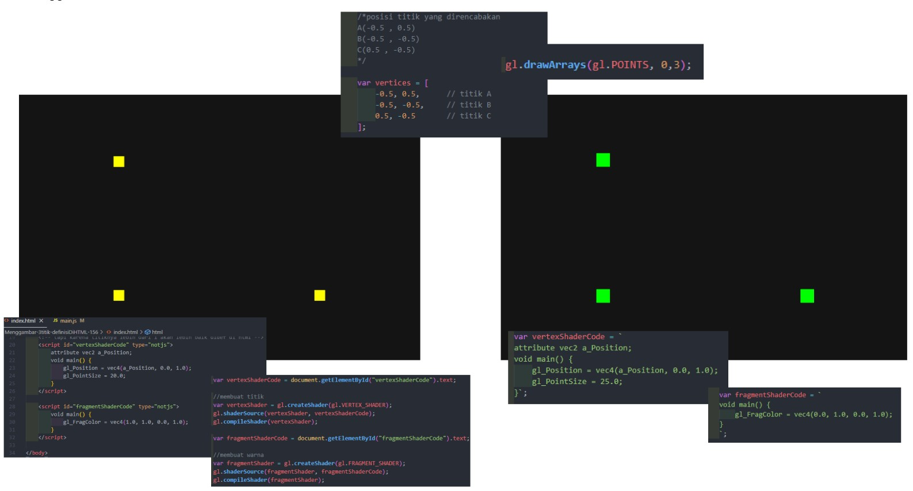
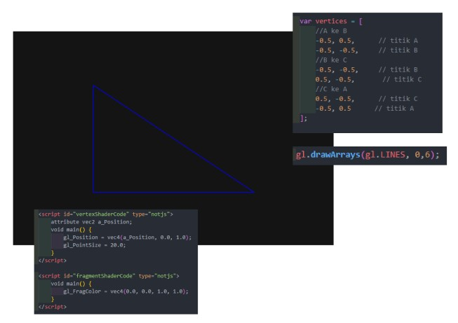
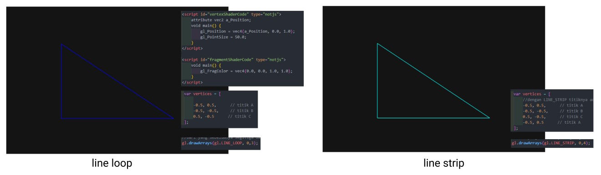
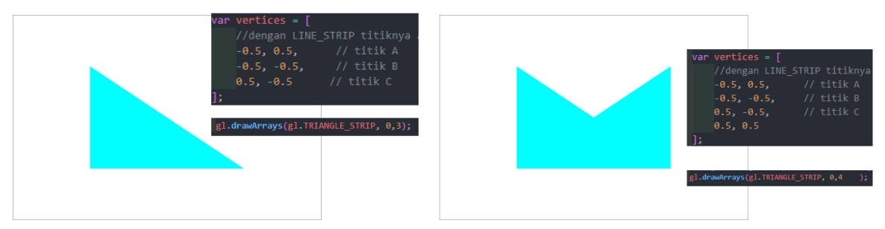
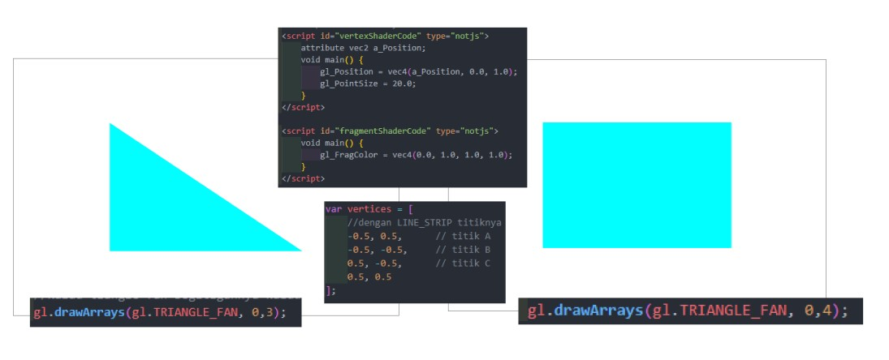
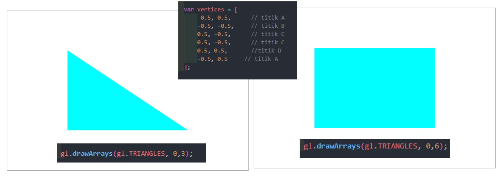
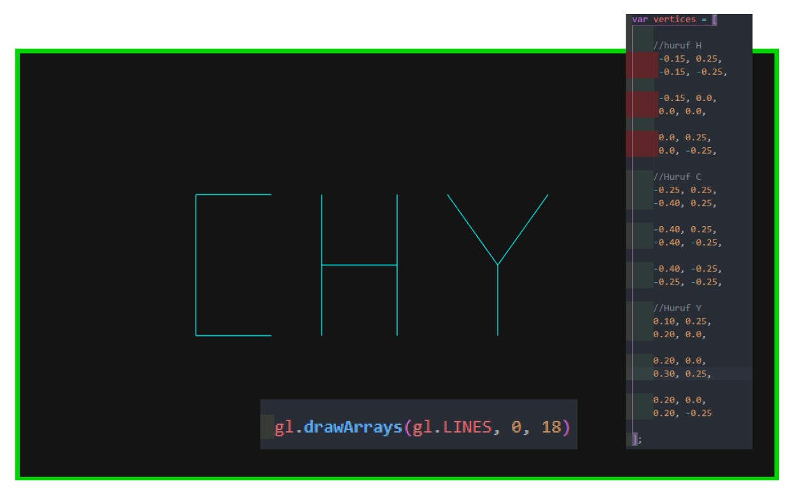

# menggambar-primitif-Cahyadesthian-156
menggambar-primitif-Cahyadesthian-156 created by GitHub Classroom
## (titik, 3 titik, 3 titik segitiga, line loop, line strip, triangle strip, triangle fan, triangles, huruf)

### ▶️ Titik

### ▶️ 3 Titik

### ▶️ 3 titik segitiga

### ▶️ Line loop dan line strip 

### ▶️ Triangle strip

### ▶️Triangle fan

### ▶️Triangles

### ▶️Huruf

